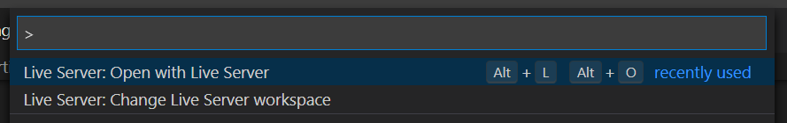
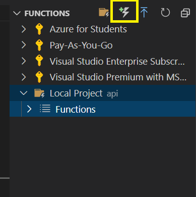
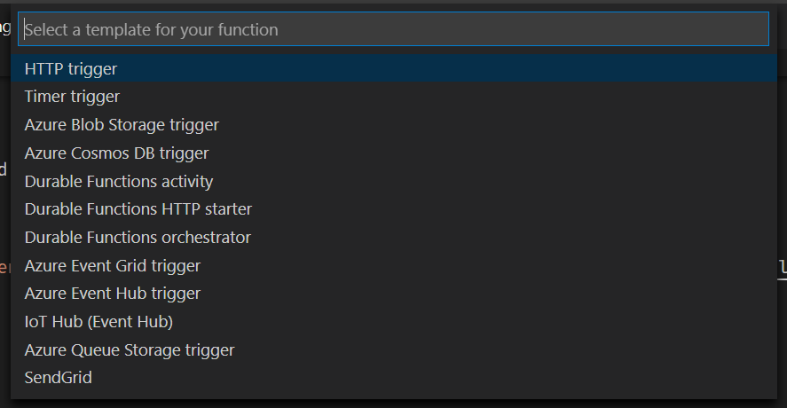
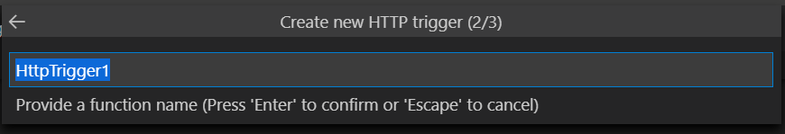
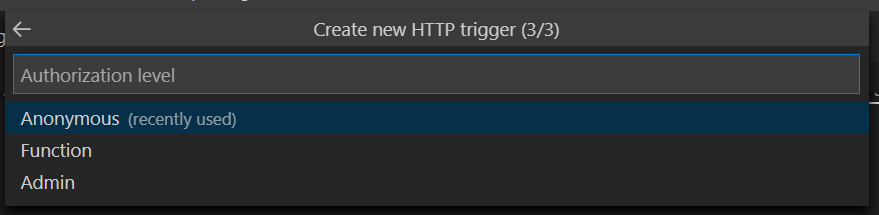

# Updating code

When it comes time to update the code, you will make all the necessary changes like you typically would. Below are a couple of key items which might be a little different - setting up your environment to run the code locally, add new Azure Functions for additional server-side APIs, and deploying the code.

## Running code locally

We will depend on two tools we [installed previously](getting-started.md#install-local-tooling) - [Azure Functions Core Tools](https://www.npmjs.com/package/azure-functions-core-tools) and [Live Server](https://marketplace.visualstudio.com/items?itemName=ritwickdey.LiveServer).

### Starting the functions/server

Open a command line or terminal window and navigate to the folder containing your project. You will start the functions service by using the following commands:

```bash
cd api
func start host
```

### Starting the site/client

We will use Live Server to host our site. To start the server, hit **Ctl-Shift-P** (or **Cmd-Shift-P** on a Mac), and type **Live Server: Open with Live Server**.



### View your site

Open a browser, and navigate to [http://localhost:5500], and you can see everything in action!

## Adding new Azure Functions

To add new functions, you will use the [Azure Functions extension](https://marketplace.visualstudio.com/items?itemName=ms-azuretools.vscode-azurefunctions) for Visual Studio Code.

- Click the Azure icon in the toolbar


- In the **FUNCTIONS** section, open **Local Project api**, and click **New Function**



- Choose **HTTP trigger** for the template



- Provide a name



- Set **Anonymous** as the authentication level



Your new function is added!

## Deploying changes

Azure Static Web Apps uses [GitHub Actions](https://github.com/features/actions) to manage deployment. Whenever code is merged into your main branch on GitHub, it is automatically deployed to Azure Static Web Apps! This fits perfectly into your normal workflow. To push changes to your server, you can execute the following commands to add all your code, commit it, and then push it:

```bash
git add .
git commit -m "Commit message"
git push
```

After a few minutes, your code will automatically be deployed to Azure Static Web Apps!
